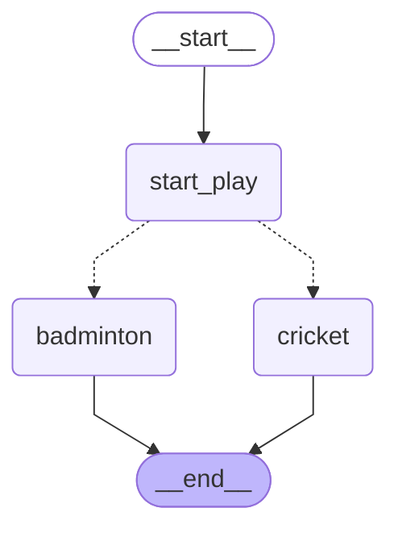

# LangGraph Simple Game Selection App

A simple demonstration of using LangGraph to create a stateful application that randomly selects between two games (Cricket or Badminton).

## Overview

This project showcases:
- Creating a state graph with LangGraph
- Implementing conditional edges with random selection
- Managing state throughout a graph execution
- Visualizing the graph flow with Mermaid

## Structure

The application consists of the following components:
- A `State` class that tracks graph information as a string
- Three processing nodes:
  - `start_play`: Entry point that initiates the game selection process
  - `cricket`: Node that selects Cricket as the game
  - `badminton`: Node that selects Badminton as the game
- A `random_play` function that randomly decides between Cricket and Badminton

## Flow Diagram

The graph has the following structure:
1. START → start_play
2. start_play → cricket OR badminton (randomly chosen)
3. cricket → END
4. badminton → END



## Requirements

- Python 3.8+
- LangGraph
- typing_extensions

## Installation

```bash
pip install langgraph typing_extensions
```

## Usage

```python
# Import the compiled graph
g = graph.compile()

# Invoke the graph with an initial state
result = g.invoke({'graph_info': "my name is muhammed"})

# Output will be something like:
# {'graph_info': 'my name is muhammed I am planning to play Badminton'}
# or
# {'graph_info': 'my name is muhammed I am planning to play Cricket'}
```

## Example Output

When running the graph:
```
Start Play node has been called
Badminton node has been called
```

And the resulting state:
```
{'graph_info': 'my name is muhammed I am planning to play Badminton'}
```

## License

MIT
