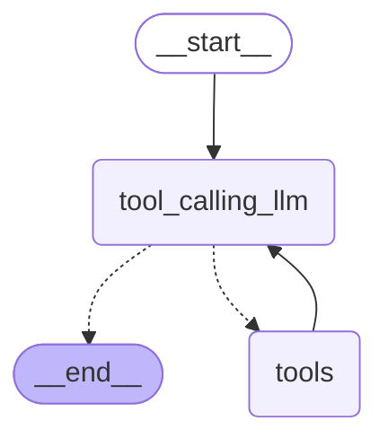

# LangGraph Tool Integration Demo

A demonstration of integrating multiple external tools with LangGraph and Groq's Qwen model to create an intelligent agent that can access real-time information.

## Overview

This project showcases how to build an agent that can:
- Search the web using Tavily
- Query academic papers using ArXiv
- Access encyclopedic knowledge using Wikipedia
- Process natural language queries and decide which tool to use

The agent leverages LangGraph's state management capabilities to create a flow that:
1. Processes user queries through a language model
2. Identifies which external tool is most appropriate for the query
3. Routes the query to the selected tool
4. Returns the processed information to the user

## Features

- **Multi-tool Integration**: Connect to Wikipedia, ArXiv, and Tavily search APIs
- **Intelligent Tool Selection**: Uses Groq's Qwen model to route queries to appropriate tools
- **State Management**: Maintains conversation context using LangGraph's StateGraph
- **Direct LLM Answers**: Handles simple questions directly without tool calls

## Architecture

The system is built around a StateGraph with the following components:



## Setup Requirements

1. Python 3.8+
2. Required packages:
   - langchain
   - langchain_community
   - langchain_groq
   - langgraph
   - dotenv
   - typing_extensions

3. API Keys (stored in .env file):
   - Tavily_API_key
   - Groq_API_key

## Installation

1. Clone this repository
2. Install dependencies:
```bash
pip install langchain langchain_community langchain_groq langgraph python-dotenv typing_extensions
```
3. Create a `.env` file with your API keys:
```
Tavily_API_key=your_tavily_api_key
Groq_API_key=your_groq_api_key
```

## Usage

```python
# Initialize the graph
from langgraph.graph import StateGraph
from typing_extensions import TypedDict
from langchain_core.messages import AnyMessage
from typing import Annotated
from langgraph.graph.message import add_messages

# Create state structure
class State(TypedDict):
    messages: Annotated[list[AnyMessage], add_messages]

# Create and compile the graph
graph = builder.compile()

# Invoke the graph with a message
messages = graph.invoke({"messages": "what is the latest news on virat kohli?"})

# Print all messages in the conversation
for m in messages["messages"]:
    m.pretty_print()
```

## Example Queries

- **Simple math**: "what is 2 plus 2?"
- **Academic research**: "what is the latest research on quantum computing?"
- **Factual knowledge**: "who is ronaldo"
- **Current events**: "what is the latest news on virat kohli?"
- **Multi-tool queries**: "what is the latest research on AI and then who hosted the fifa world cup 2022?"

## Tool Details

1. **ArXiv Integration**:
   - Queries academic papers
   - Returns published date, title, authors, and summary

2. **Wikipedia Integration**:
   - Searches Wikipedia for factual information
   - Returns page title and summary

3. **Tavily Search**:
   - Performs web searches for current information
   - Returns multiple relevant results with URLs and content snippets

## License

MIT License

## Acknowledgments

- LangChain for the foundation tools
- LangGraph for the state management framework
- Groq for the Qwen model access
